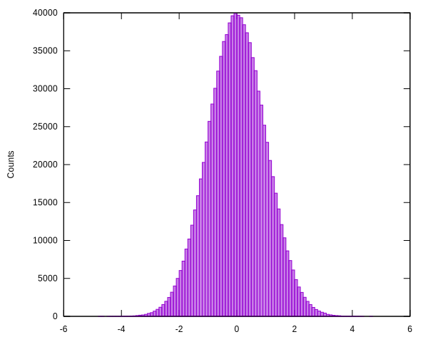

# Normal deviates
Generate pseudorandom numbers from a normal (Gaussian) distribution.
System and package are named `normal-dev`.

**Warning**: I think the algorithm used is not suitable where high
quality pseudorandom numbers are needed. I need to read about this.

## Usage
**nrand** &optional mean std => normal-deviate

`(nrand mean std)`

Draw a pseudorandom number from a normal distribution with mean
*mean* (default 0) and standard-deviation *std* (default 1).
The result is always a `double-float`.

## Example
Let's draw 1M pseudorandom numbers from the normal distribution.

```common-lisp
(defparameter *nvals* (make-array 1000000 :element-type 'double-float))
(loop for i from 0 below (length *nvals*) do
  (setf (aref *nvals* i) (normal-dev:nrand)))
```

Now, using [histogram](https://github.com/thomashoullier/histogram), we
compute and plot the histogram.

```common-lisp
(defparameter *hist* (histogram:make-hist (list -5d0 5d0) 100 :data *nvals*))
(histogram:tofile *hist* <filename>)
```



Validation by visual inspection: "Seems pretty normal to me."

## Implementation
We use the algorithm of ratio of uniforms with bounds by Leva [1].
The deviate is built using the in-built `random` function. You can
set the seed for that if you want repeatability.

## Caveats
* I only tested the generator via visual assessment of the histogram.
* I do not know the pros and cons of using the algorithm from Leva. It
  seems it is no longer state of the art, neither for quality nor speed.
  I might update it to something more recent sometime.

## Dependencies
* `normal-dev`: None.
* `normal-dev/test`:
  * [rove](https://github.com/fukamachi/rove)

## Test
Run tests with:

```common-lisp
(asdf:test-system "normal-dev")
```

The tests include a performance test: 1M samples are drawn and a timing
is taken. This is so you can quickly check whether the performance on your
machine is compatible with your application. The performance could be
improved by declaring various types for your compiler etc., which I did
not do.

## References
1. J. L. Leva, “A fast normal random number generator,” ACM Transactions on
   Mathematical Software 18(4), 449–453 (1992).
   https://doi.org/10.1145/138351.138364
